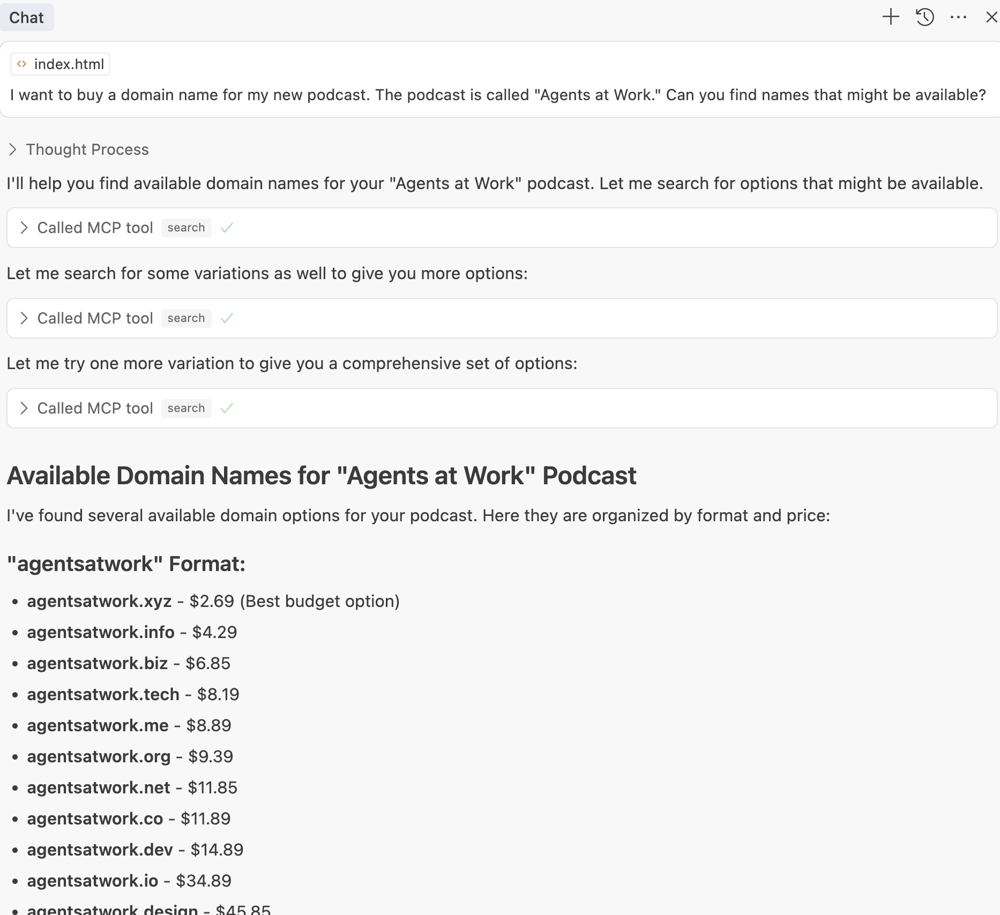
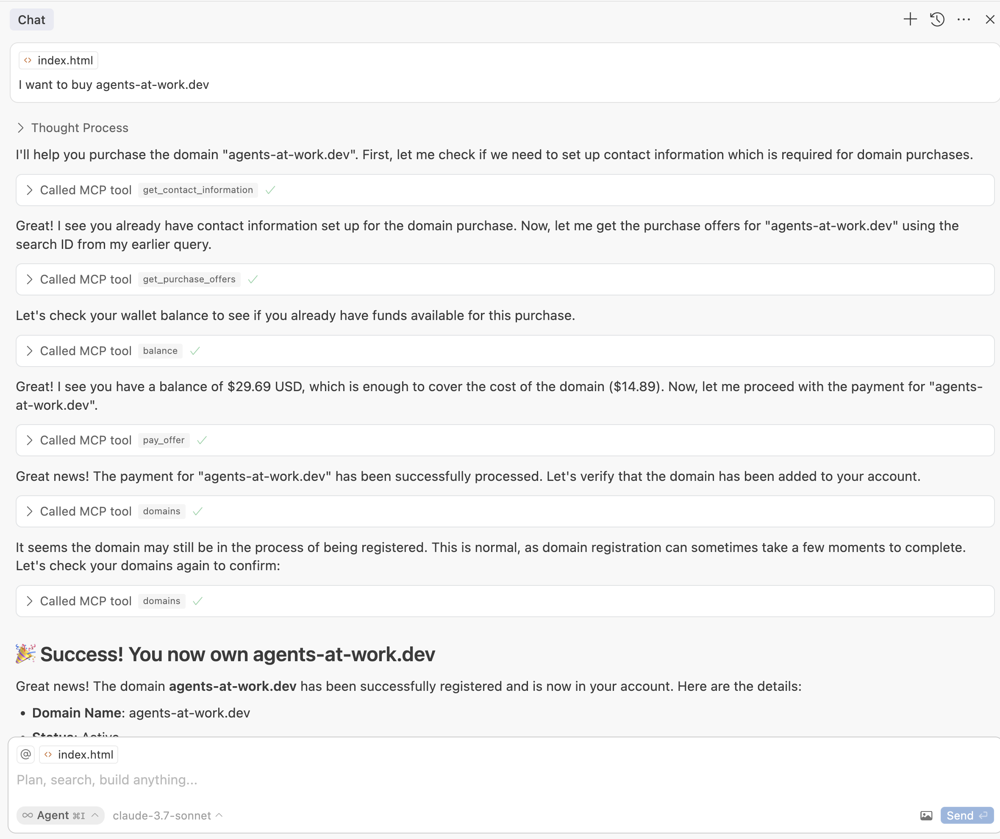
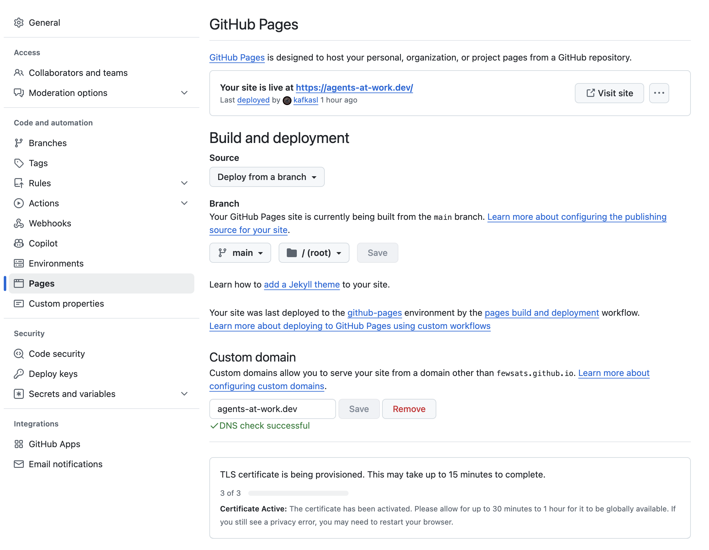
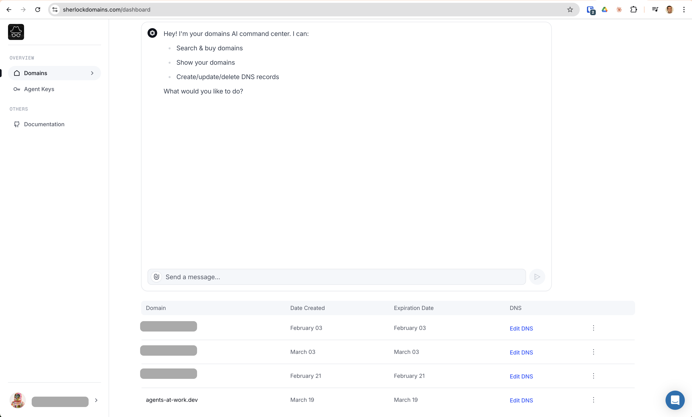
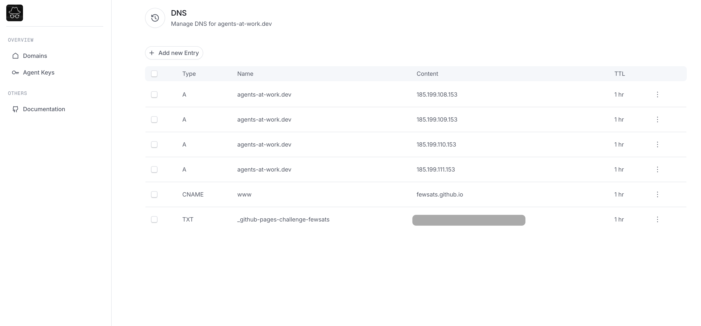

# Go Live: Buy your first domain with Cursor & Fewsats MCP

Ready to share your creation with the world? This guide will take you from zero to having your own website or game online with a custom web address that's all yours - no technical expertise required! Whether you've built a simple portfolio, a personal blog, or your first browser game, by the end of this guide you'll have it live on the internet with a professional-looking URL that you can proudly share with friends, family, or potential employers.

This step-by-step walkthrough covers everything: buying your own domain name (like "yourgame.com" or "yourname.dev"), setting it up correctly, and publishing your site - all using simple tools and plain English instructions.

## Prerequisites

- [Cursor](https://cursor.sh/) installed
- [UV](https://docs.astral.sh/uv/getting-started/installation/) installed
- [GitHub](https://github.com/) account
- Repository with your website files (at least an `index.html`)
- Fewsats account with funds or payment method configured. [Register here](https:/fewsats.com)

---

## Step 1: Prepare Your GitHub Repository

If you don't have a GitHub repository yet:

- Go to [GitHub](https://github.com/) and create a new repository.
- Upload your website files (HTML, CSS, images, etc.) to the repository.
- Ensure your main HTML file is named `index.html` and placed in the root directory.

---

## Step 2: Add MCP Servers in Cursor

With the latest Cursor update, you need to manually add the MCP configuration (a cleary downgrade in UI in my opinion). When prompted, create a new global MCP server and add the following:

```json
{
  "mcpServers": {
    "Fewsats": {
      "command": "env",
      "args": [
        "FEWSATS_API_KEY=YOUR_FEWSATS_API_KEY",
        "uvx",
        "fewsats-mcp"
      ]
    },
    "Sherlock Domains": {
      "command": "uvx",
      "args": [
        "sherlock-mcp"
      ]
    }
  }
}
```

Make sure to replace `YOUR_FEWSATS_API_KEY` with your actual API key. You can create one [here](https://app.fewsats.com/api-keys).

After adding this configuration, restart Cursor and both MCP servers should show up in green.

---

## Step 3: Search and Buy Your Domain

In Cursor's agent mode, prompt the AI to find available domain names:

```prompt
I want to buy a domain name for my new podcast. The podcast is called Agents at Work. Can you find names that might be available?
```




The AI will suggest available domains. Choose one and instruct the AI to buy it:

```prompt
I want to buy agents-at-work.dev
```

The AI will request your contact information as required by ICANN in order to register the domain to your name. 

In order to purchase the domain you will have to add a payment method to Fewsats, or, if you prefer, top it up with the amount required to cover the price.




---

## Step 4: Deploy Your Website with GitHub Pages

- Go to your GitHub repository.
- Navigate to `Settings` → `Pages`.
- Under "Build and deployment," select:
  - Source: `Deploy from a branch`
  - Branch: `main`
  - Folder: `/ (root)`
- Click `Save`.

GitHub will deploy your website and provide a temporary URL in this format `https://{YOUR_ACCOUNT_NAME}.github.io/{YOUR_REPO_NAME}`. In our case, `https://fewsats.github.io/agents-at-work`


---

## Step 5: Configure DNS for GitHub Pages

In GitHub Pages settings, add your custom domain (e.g., `agents-at-work.dev`) and save.

GitHub will prompt you to configure DNS records. Provide these instructions to Cursor's agent mode:

```prompt
Make sure there are no DNS entries before adding new ones. Then point the domain we just bought to the IP addresses for GitHub Pages:

185.199.108.153  
185.199.109.153  
185.199.110.153  
185.199.111.153  

Also add a CNAME record that points the www subdomain to your GitHub Pages URL (e.g., fewsats.github.io).
```

The AI will clear existing DNS records and set up the new ones.

Once the DNS propagates, your github pages should look like this:




---

## Step 6: Verify Domain Ownership (Optional but Recommended)


GitHub recommends verifying domain ownership. To do so:

1. Go to `https://github.com/settings/pages`
2. Add your domain name -> `agents-at-work.dev`
3. Click `Copy Instructions` and give them to Cursor. 
4. Provide the instructions to Cursor's agent mode (they should look like below)

```prompt
Verify the domain ownership with these instructions:

1. Create a TXT record in your DNS configuration for the following hostname: _github-pages-challenge-xyz.yourdomain.dev
2. Use this code for the value of the TXT record: YOUR_VERIFICATION_CODE
```

The AI will handle the DNS verification setup.

---

## Step 7: Enforce HTTPS (Recommended)

Once DNS propagation is complete (may take a few minutes to hours):

- Go back to GitHub Pages settings.
- Enable "Enforce HTTPS" to secure your website.

---

## Step 8: Link your Sherlock Domains account (optional)


[Sherlock Domains](sherlockdomains.com) provide a UI to manage your domains and DNS. In order to log in, you will need to link it using MCP with your email. 





Just tell Cursor Agent:

```prompt
I want to link the following email your@email.com to my sherlock account.
```

After this you will receive an email and will be able to view your records. If you completed successfully this guide they should look like this:




## Troubleshooting

- **DNS propagation delays:** DNS changes can take up to 24 hours. If verification fails initially, wait and retry later.
- **Payment issues:** Ensure your Fewsats account has sufficient funds or a valid payment method.
- **Cursor MCP issues:** Ensure your API keys and MCP servers are correctly configured.

---

## Congratulations 🎉

Your website is now live with a custom domain, securely hosted on GitHub Pages!

If you have any questions or comments:
 - Join our [Discord](discord.gg/2tPYBgWzQm)
 - Follow us on [X](https://x.com/fewsats)
---
